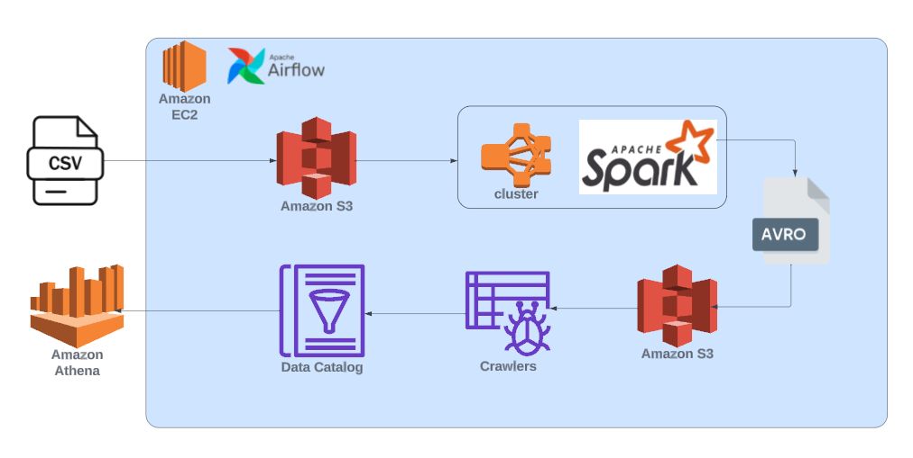

# Overview

## Tech Stack 
* AWS Glue Data Catalog
* AWS Glue Crawler
* AWS EMR
* AWS EC2
* Apache Spark
* Airflow
* Amazon S3
* Amazon Athena
* SQL
* Python

## Overview 
In this project, we created a entire workflow orchestrate with Airflow, which will upload the csv files and spark job in python to the S3 bucket, create an EMR Cluster to execute the spark job, that are going to clean the data and load it to another s3 bucket in avro format with the appropriate data model, create a glue crawler, and data catalog to query the resulting data with aws Athena. 

## Data model 

## Airflow DAG 
