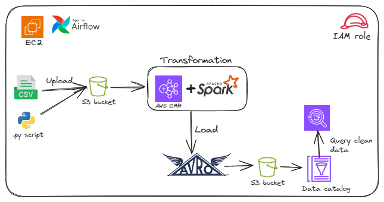
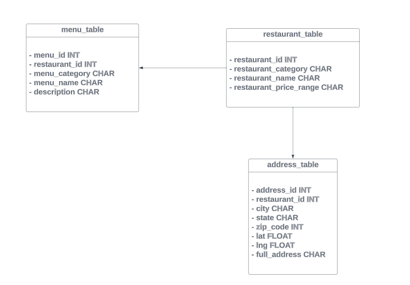
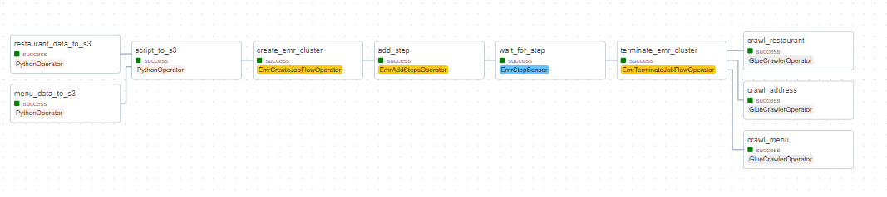
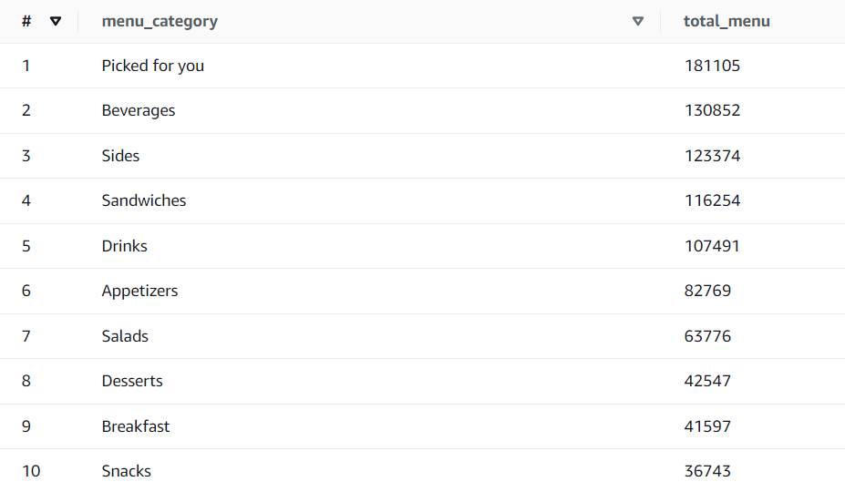
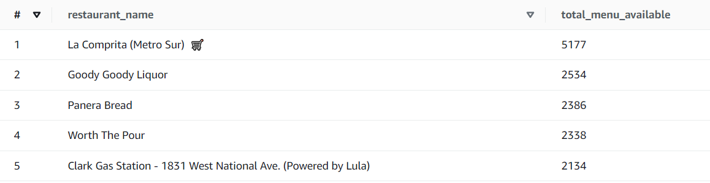
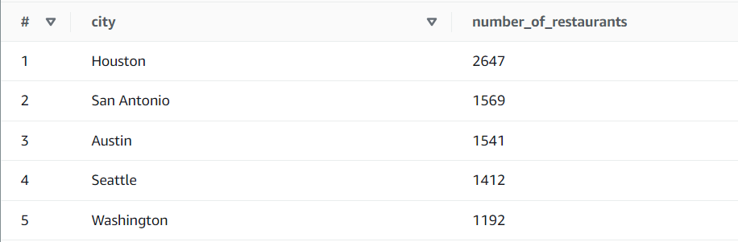
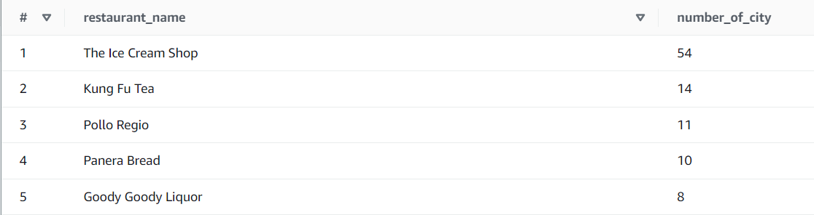

# Overview

## Tech Stack 
* AWS Glue Data Catalog
* AWS Glue Crawler
* AWS EMR
* AWS EC2
* Apache Spark
* Airflow
* Amazon S3
* Amazon Athena
* SQL
* Python

## Project Overview 
In this project, we created an entire workflow orchestrated with Airflow. The workflow involves:

- Uploading CSV files and spark script on S3.
- Creating an EMR Cluster to execute the Spark job, which cleans the data and loads it into another S3 bucket in Avro format with the appropriate data model.
- Creating a Glue Crawler and a Data Catalog to facilitate querying the resulting data with AWS Athena.
- Querying the resulting tables with AWS Athena.

## Data Model

## Airflow DAG

## Analytics
Let's answer some questions to understand our data:

1. Most popular menu category in terms of the total number of menus:
    
   P.S: I like sandwiches, and you? :)

2. What are the restaurants with the most total number of menus:
   

3. Which city has the most number of restaurants:
   
   Ohhh! Houston has the most number of restaurants.

4. Which restaurants are available in the most number of cities:
   

